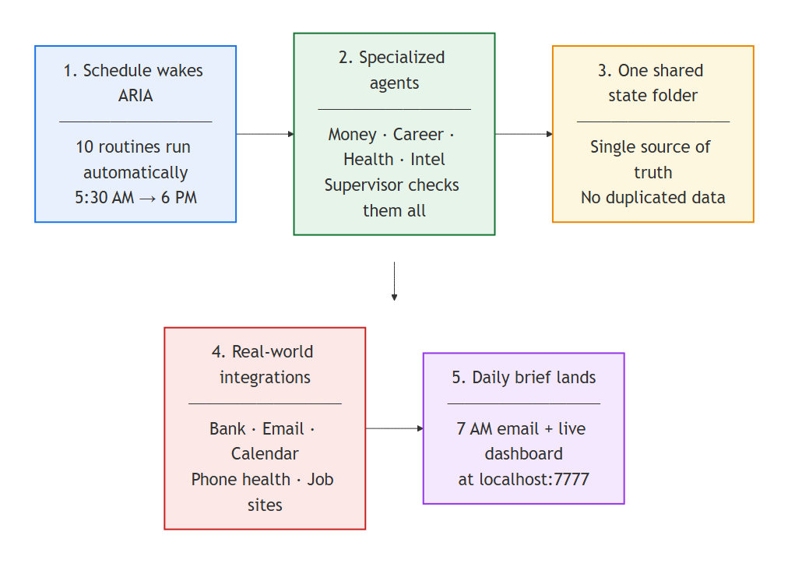

# ARIA — a personal multi-agent AI system

[](https://github.com/jobradshaw98-dude/aria/actions/workflows/ci.yml)
[](LICENSE)

ARIA is a fleet of specialized AI agents that run on a schedule, share one source
of truth, monitor each other, and deliver a daily brief. I built and operate it to
automate the research, analysis, and routine knowledge work I'd otherwise do by
hand — and to learn, by building, how to architect production systems *of* AI
agents rather than one-off prompts.

It runs daily. This repository is a curated, sanitized slice of it: the
architecture, plus two self-contained subsystems you can actually run.



## Why this exists

Most "AI projects" are a single clever prompt or a notebook. ARIA is the opposite:
a small **system** with the properties real software needs —

- **Specialized agents** with scoped context, so domains don't bleed into each other.
- **One shared state hub** as the single source of truth — no per-agent copies, no drift.
- **A supervisor agent** that audits the fleet on a schedule, remediates from a playbook, and escalates judgment calls to a human.
- **Deterministic gates with tests** for anything that must be trustworthy — LLMs draft and reason; plain, tested code decides.
- **Model-tiered scheduling** — cheap models for mechanical checks, stronger models for reasoning-heavy audits, so cost tracks difficulty.

Full design: **[docs/architecture.md](docs/architecture.md)**.

## What you can run here

Two subsystems are extracted with **synthetic data** so they run on their own:

### 🧠 [`memory-system/`](memory-system) — question-aware memory retrieval
A deterministic, **zero-LLM** retrieval layer (~40 ms over the demo corpus) that
surfaces the right few memory files for a prompt — including notes reachable only by following links
between them (keyword *seed* → 1-hop wiki-link *walk*, degree-penalized so hubs
don't flood results). Runs as a Claude Code hook. Ships with a 16-note demo corpus.

```bash
cd memory-system/hooks
python memory-retrieve.py "how does helios auth handle secrets"
# returns the auth note directly AND link-walks to the oauth-setup + secrets notes
```

### 📨 [`apply-engine/`](apply-engine) — multi-stage automation with real gates
A headless engine that drives web forms across several backends (with a generic
fallback), drafts content with quality gates, and stages output to a final-review
brink — it never submits on its own. Demonstrates adapter patterns, deterministic
submit-gates, work-authorization policy enforcement, and a **1,057-test suite at
74% coverage**. All identity/data here is a fictional sample applicant.

```bash
cd apply-engine
python -m venv .venv

# Windows:
.venv/Scripts/python.exe -m pip install -r requirements.txt && .venv/Scripts/python.exe -m pytest tests/ -q
# macOS/Linux (pywin32 auto-skips via an environment marker; offline suite still runs):
.venv/bin/python -m pip install -r requirements.txt && .venv/bin/python -m pytest tests/ -q
```

> A standalone, installable version — with an added profile-driven résumé + cover-letter
> generator — lives in its own repo: **[job-apply-engine](https://github.com/jobradshaw98-dude/job-apply-engine)**.

## Repository layout

```
aria/
├── docs/
│   ├── architecture.md      system design + diagrams
│   └── diagrams/            architecture diagrams (PNG)
├── memory-system/           showcase 1 — retrieval hook + demo corpus
└── apply-engine/            showcase 2 — automation engine + test suite
```

## Build your own

The reusable structure behind ARIA — the CLAUDE.md cascade, shared data hub, memory
hook, and scheduled-task pattern — is extracted as a clean starter scaffold (available on
request).

## A note on scope & privacy

The live system includes more agents (finance, research/intel, ops, QA, and the
supervisor) and connects to real personal data. Those are intentionally **not**
published — this repo is a sanitized showcase of the architecture and the two
subsystems that stand on their own. No secrets, credentials, or personal data are
included; see [`docs/architecture.md`](docs/architecture.md) for the full picture.

## About

Built by Jordan Bradshaw — an R&D / simulation engineer (FEA, design optimization)
who builds multi-agent AI systems that do real work autonomously. ARIA is the largest of them.

License: [MIT](LICENSE).
