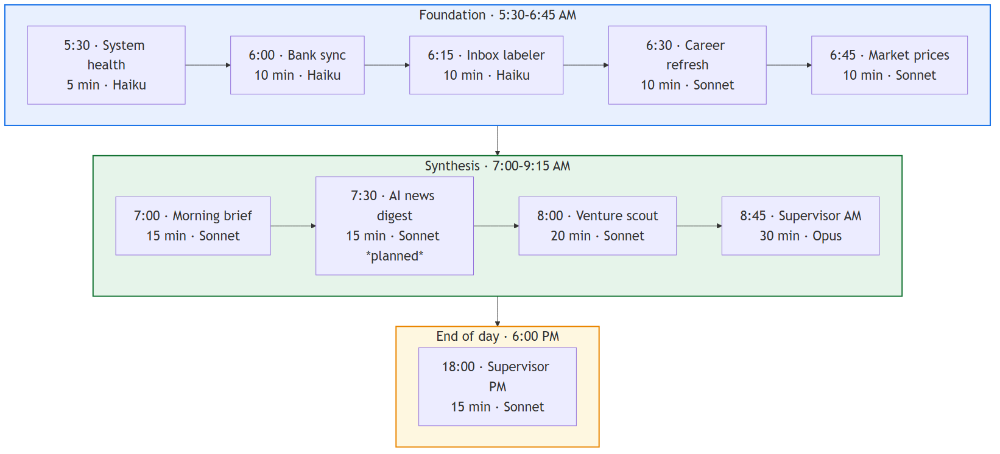
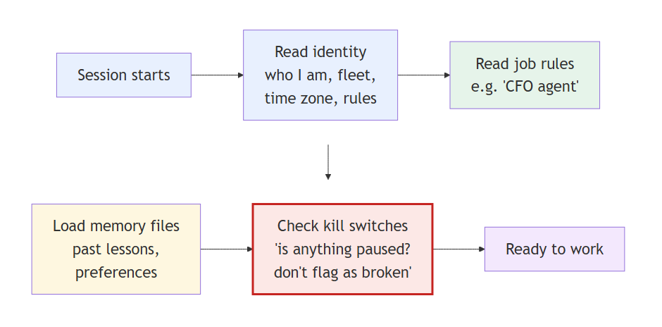

# ARIA — System Architecture

ARIA is a personal multi-agent system: a fleet of specialized AI agents that run
on a schedule, share one source of truth, monitor each other, and surface a daily
brief — built and operated by one engineer to automate research, analysis, and
routine knowledge work.

This document describes the *design*. Two of the more interesting subsystems ship
as runnable code in this repo — see [`memory-system/`](../memory-system) and
[`apply-engine/`](../apply-engine).

## Design principles

1. **One source of truth.** Every agent reads and writes a single shared state
   folder. No agent keeps its own private copy of a fact, so there's no
   cross-agent drift to reconcile. Derived/aggregate values are computed live,
   never cached into state.
2. **Agents are specialized, not monolithic.** Each domain (finance, career,
   research, ops, health) is its own agent with its own context and rules,
   loaded only when that domain is in scope. A change to one agent can't silently
   break another.
3. **A supervisor watches the fleet.** A higher-order agent audits the others on a
   schedule, detects drift between policy and state, and either remediates from a
   playbook or escalates the judgment call to a human.
4. **Deterministic where it matters.** Gates, scoring, and retrieval that must be
   trustworthy are plain code with tests — not an LLM asked to be careful. LLMs
   draft and reason; deterministic checks decide.
5. **Intentional pauses are first-class.** A "kill-switch registry" records
   deliberately-disabled workflows so an audit never mistakes an intentional pause
   for a failure.

## The pieces

### Agent fleet
A set of specialized agents (finance, career, research/intel, ops/IT, QA, plus a
supervisor). Each has a scoped instruction file that loads based on the working
context — global rules at the root, agent-specific rules nested below, cascading
so the most specific rules win.

### Shared data hub
A single state directory addressed through one environment variable. All agents
resolve it the same way, so the same fact lives in exactly one place. State is
structured JSON; documents and long-form notes live in a linked knowledge vault.

### Scheduled routines
Time-triggered tasks wake agents through the day (early-morning data refreshes →
mid-day audits → end-of-day summary). Each routine runs at a **model tier matched
to its difficulty** — a cheap model for mechanical health checks, a stronger model
for reasoning-heavy audits — to keep cost proportional to the work.

### Memory layer
Beyond the shared state, agents have a persistent, file-based memory of durable
facts, preferences, and decisions. A retrieval hook surfaces the *relevant* few
memories for each prompt — including ones reachable only by following links
between notes. This subsystem is documented and runnable in
[`memory-system/`](../memory-system).

### External integrations
Agents reach the outside world through scoped tool integrations — financial data,
email/calendar, messaging for approvals, research/search, and a local web
dashboard that renders current state. Secrets live only in gitignored config and
environment variables; nothing sensitive is committed.

## What's in this repo

This is a **curated, sanitized showcase** — not the full private system. It
publishes the architecture and two self-contained subsystems with synthetic data:

| Component | What it demonstrates |
|---|---|
| [`memory-system/`](../memory-system) | Deterministic, zero-LLM question-aware retrieval over a linked note corpus |
| [`apply-engine/`](../apply-engine) | A multi-stage automation engine with deterministic gates and a real test suite |

The remaining agents (supervisor, finance, research, ops, etc.) are described here
to show the system's scope; their code and all personal/state data are kept
private.
